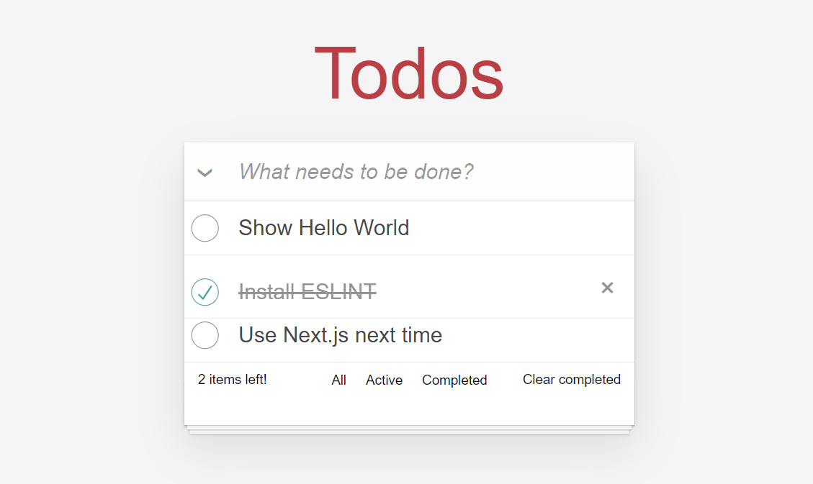

# Todo App

Este es un proyecto de aplicación de lista de tareas (Todo App) construido con TypeScript y React, utilizando Framer Motion para animaciones y ViteJS como el bundler.

## Características

- **React con TypeScript**: Aprovecha las ventajas de los tipos estáticos para un desarrollo más robusto.
- **Framer Motion**: Animaciones fluidas y personalizables.
- **ViteJS**: Desarrollo rápido y construcción eficiente.

## Capturas de pantalla



## Requisitos

- Node.js (>= 18.x)

## Instalación

1. Clona este repositorio:

    ```bash
    git clone https://github.com/NewHub25/todo-app.git
    cd todo-app
    ```

2. Instala las dependencias:

    ```bash
    npm install
    ```
   
